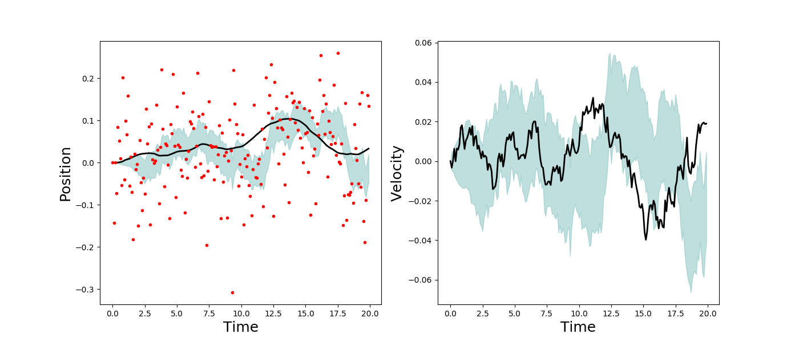
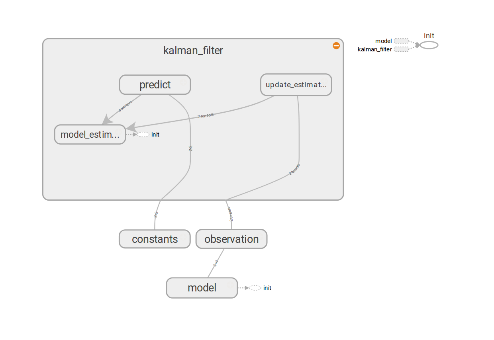

This code is an implementation of the Kalman Filter described [here][kalman-wiki].  The model describes a mass on a frictionless surface buffeted by normally distributed random forces.  The Kalman Filter attempts to estimate the position and velocity of the mass based on noisy observations of the position.  The results are below:

Here the solid black line is the ground truth, the shaded region is the Kalman Filter estimate and the red dots show the observations.

The filter is implemented in python using the TensorFlow framework.  Below is the computational graph:

[kalman-wiki]: https://en.wikipedia.org/wiki/Kalman_filter#Example_application,_technical
